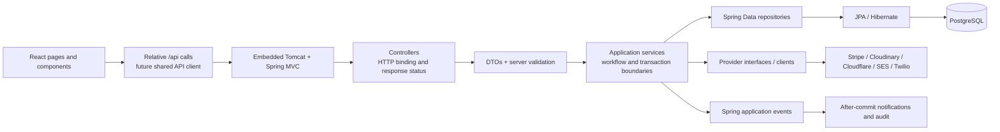
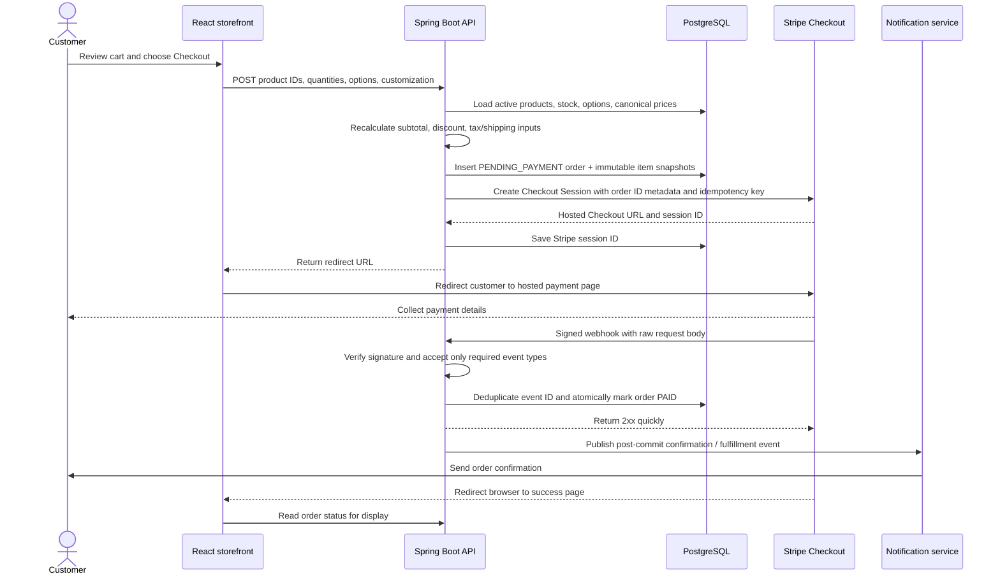
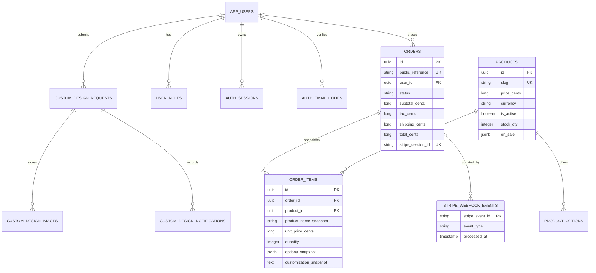
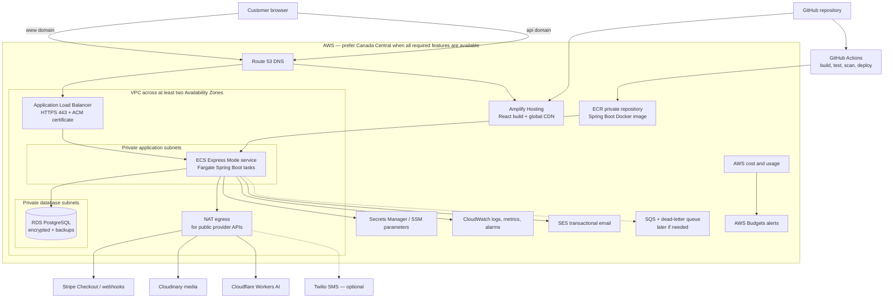

# Isa's Signs & Designs / Thread & Butter — System Architecture HLD

> Reconstructed from the repository, living handover, supporting design documents, and recovered
> chat history. Audited: 2026-08-08.
>
> This document separates **implemented reality** from the **target architecture**. The source code
> and Flyway migrations remain authoritative when older notes disagree.

## 1. Executive answer

The intended product is a Canada-first ecommerce storefront plus a custom Embroidery/Printing
request-and-quote platform. The right architecture for one developer is a **modular monolith**:

- one React/TypeScript single-page application;
- one Java/Spring Boot REST API;
- one PostgreSQL database;
- one Docker image for the backend;
- managed providers for payments, media, AI, email, DNS, TLS, hosting, logs, and backups.

This is deliberately not a microservice system. The code already has useful internal boundaries—
controllers, services, repositories, provider clients, DTOs, validation, and application events—
without the operational cost of many deployable services.

The final customer journey is:

```text
Discover products or custom services
        -> browse a database-backed catalog
        -> configure a product or submit a design request
        -> add standard products to a persistent cart
        -> backend recalculates price and creates an order
        -> customer pays on Stripe-hosted Checkout
        -> verified Stripe webhook marks the order paid
        -> customer and owner receive transactional notifications
        -> owner fulfills the order and updates its status
```

Custom Embroidery and Printing requests remain **quote workflows**, not automatically payable
orders. After manual review, an accepted quote can later become an order and receive a Stripe
Checkout link.

### Brand decision still required

The repository is named **Isa's Signs & Designs**, while the current homepage, studio flows, request
numbers, and emails are branded **Thread & Butter**. Before choosing the production domain, Stripe
statement descriptor, sender domain, legal entity copy, and analytics identity, decide whether:

1. Isa's Signs & Designs is the parent business and Thread & Butter is the apparel sub-brand; or
2. Thread & Butter is replacing the original customer-facing brand.

The architecture works either way, but production identity must be consistent.

## 2. Status legend

| Status | Meaning |
|---|---|
| Implemented | Present in current source and substantially functional. |
| Partial / prototype | UI or infrastructure exists, but the complete production path does not. |
| Planned for MVP | Required before customers can place reliable paid orders. |
| Later | Valuable after the commerce MVP is stable. |

## 3. Complete logical architecture

```mermaid
flowchart TB
    Customer["Customer browser"]
    Owner["Owner / future administrator"]

    subgraph Frontend["React + TypeScript SPA"]
        Router["React Router and global layout"]
        CatalogUI["Home, categories, product detail, FAQ"]
        StudioUI["Shared Embroidery / Printing Design Studio"]
        AuthUI["Passwordless account UI prototype"]
        CommerceUI["Search, cart, checkout, account, orders"]
        AdminUI["Admin catalog / request / fulfillment UI"]
    end

    subgraph Backend["Java 21 Spring Boot modular monolith"]
        CatalogAPI["Product REST controller + DTO mapping"]
        StudioAPI["Embroidery and Printing multipart controllers"]
        StudioServices["Validation, prompt, preview, submission services"]
        ProviderAdapters["Cloudflare, Cloudinary, SMTP, Twilio adapters"]
        EventNotifications["After-commit notification listener + audit"]
        SecurityAPI["Spring Security, OTP, JWT, refresh, CSRF, ownership"]
        CommerceAPI["Cart validation, orders, Stripe Checkout + webhook"]
        AdminAPI["Role-protected catalog and fulfillment services"]
        OpenAPI["Springdoc OpenAPI / Swagger"]
    end

    subgraph Data["PostgreSQL"]
        Products[("products")]
        Requests[("custom design requests + images")]
        Notifications[("notification audit")]
        Users[("users / roles / codes / sessions")]
        Orders[("orders / order_items / payment events")]
    end

    Cloudinary["Cloudinary\npublic catalog media + protected customer assets"]
    CloudflareAI["Cloudflare Workers AI\nFLUX image previews"]
    Email["Amazon SES in production\nGmail SMTP for local testing"]
    Twilio["Twilio SMS — optional / disabled"]
    Stripe["Stripe-hosted Checkout + signed webhooks"]

    Customer --> Router
    Owner --> Router
    Router --> CatalogUI
    Router --> StudioUI
    Router --> AuthUI
    Router -.-> CommerceUI
    Router -.-> AdminUI

    CatalogUI -->|"GET /api/products"| CatalogAPI
    CatalogAPI --> Products
    CatalogUI --> Cloudinary

    StudioUI -->|"multipart preview / request"| StudioAPI
    StudioAPI --> StudioServices
    StudioServices --> ProviderAdapters
    StudioServices --> Requests
    ProviderAdapters --> CloudflareAI
    ProviderAdapters --> Cloudinary
    StudioServices --> EventNotifications
    EventNotifications --> Notifications
    EventNotifications --> Email
    EventNotifications -.-> Twilio

    AuthUI -.-> SecurityAPI
    SecurityAPI -.-> Users
    SecurityAPI -.-> Email
    CommerceUI -.-> CommerceAPI
    CommerceAPI -.-> Products
    CommerceAPI -.-> Orders
    CommerceAPI -.-> Stripe
    AdminUI -.-> AdminAPI
    AdminAPI -.-> Products
    AdminAPI -.-> Requests
    AdminAPI -.-> Orders

    CatalogAPI --> OpenAPI
    StudioAPI --> OpenAPI
    SecurityAPI -.-> OpenAPI
    CommerceAPI -.-> OpenAPI

    classDef implemented fill:#e7f6e7,stroke:#287a3d,color:#173c21;
    classDef partial fill:#fff4d6,stroke:#a66b00,color:#5c3a00;
    classDef planned fill:#f4ecff,stroke:#7750a8,color:#33204d,stroke-dasharray: 6 4;
    classDef external fill:#e8f2ff,stroke:#3774a8,color:#173852;

    class Router,CatalogUI,StudioUI,CatalogAPI,StudioAPI,StudioServices,ProviderAdapters,EventNotifications,OpenAPI,Products,Requests,Notifications implemented;
    class AuthUI,Users partial;
    class CommerceUI,AdminUI,SecurityAPI,CommerceAPI,AdminAPI,Orders planned;
    class Cloudinary,CloudflareAI,Email,Twilio,Stripe external;
```



Solid green components are implemented. Gold is a prototype/foundation. Dashed purple components
are future work. Blue components are managed providers.

## 4. Current implementation: what actually exists

### Frontend

- React `19.2`, TypeScript `5.9`, Vite `7.3`, React Router `7.13`, Tailwind CSS `3.4`.
- Global promotional bar, two-level/sticky header, brand treatment, account icon, cart icon, and
  footer.
- Homepage with optimized split-video hero, service highlights, responsive Embroidery/Printing
  sections, intersection-based playback/reveal behavior, and reduced-motion handling.
- Shared database-backed category grid and reusable product cards.
- Best Sellers is driven by `is_featured`, not a fake category.
- Product detail route with gallery, thumbnails, sale display, descriptions, specifications, and a
  UI-only Ask a Question form.
- Shared eight-card Custom Design Studio used by both Embroidery and Printing.
- Client-side image validation, form validation, AI loading/error states, preview display, and real
  multipart submission.
- Passwordless sign-up/login/account flow is connected to the Spring API. Four-digit email codes
  establish a session backed by a short-lived JWT access cookie and rotating opaque refresh token.
- The cart persists on the device and redirects to Stripe Checkout; search remains visual only.

### Backend

- Java 21 and Spring Boot `3.3.5`, built with Gradle.
- Spring MVC controllers, Spring Data JPA/Hibernate, PostgreSQL driver, Flyway, Spring Mail,
  Bean Validation, Springdoc OpenAPI, Cloudinary SDK, and image decoding/downscaling.
- Read-only product API with active/category/featured filters and slug lookup.
- Separate persistence entities and response DTOs.
- Shared Embroidery/Printing preview and request pipeline.
- Server-authoritative request and image validation.
- Cloudflare Workers AI prompt construction and preview generation.
- HMAC-signed, one-hour preview token binds submitted generated bytes to the preview returned by
  the backend.
- Protected Cloudinary upload for customer/generated images; PostgreSQL stores metadata rather
  than image bytes.
- Transactional request persistence with best-effort Cloudinary cleanup if persistence fails.
- Application event published inside the transaction and handled only **after commit**.
- Customer/admin SMTP emails with protected-image delivery copies and notification audit rows.
- Twilio delivery client exists, but current submission handling is email-only and SMS is disabled.
- Global safe API errors for request validation, provider failures, oversized uploads, and AI
  quotas.

### Database

- PostgreSQL 15 runs locally through Docker Compose.
- `products` is still created and seeded by `init.sql` as the Flyway baseline.
- Flyway migrations V2–V6 create and evolve users, custom requests, request images, notifications,
  SMS consent, and Embroidery/Printing service type.
- The legacy table name `custom_embroidery_requests` now stores both `embroidery` and `printing`
  rows. This works, but should eventually be renamed to `custom_design_requests` in a carefully
  tested migration.

### Verification on 2026-08-08

- `npm run build` passed: TypeScript and the Vite production bundle completed.
- `./gradlew test --no-daemon` passed.
- The checked-in test results contain 20 passing backend tests across validation, prompt creation,
  preview tokens, notification messages, and API error handling.
- `npm run lint` currently fails with 16 errors and one warning in existing frontend code. The
  findings are mainly React 19 hook/ref rules, one authentication-dialog declaration/dependency
  issue, and price helpers exported from a component file. The build still passes, but lint must be
  repaired before CI is configured as a required gate.
- Docker Desktop was not running during this audit, so a fresh database boot and live integration
  test were not repeated.
- The frontend production bundle currently includes about 47 MB of homepage MP4 media. Move those
  videos to responsive Cloudinary video delivery before production.

## 5. Application-layer architecture



The responsibilities are:

| Layer | Responsibility |
|---|---|
| React page/component | Present data, collect input, manage browser-only interaction state. |
| API client | Encode HTTP requests, credentials, CSRF headers, timeouts, and consistent errors. |
| Controller | Convert HTTP path/query/body/multipart data into Java inputs and return DTOs. |
| Validation/service | Enforce business rules and orchestrate a use case. |
| Repository/JPA | Read and write domain data; do not contain HTTP behavior. |
| Provider adapter | Isolate Stripe, Cloudinary, Cloudflare, SES, or Twilio-specific code. |
| Event listener | Perform non-critical follow-up after the main transaction commits. |

The product controller is currently allowed to talk directly to its repository because it is a
small read-only feature. Introduce a `ProductService` when product writes, search, options,
inventory, or admin rules are added.

## 6. Important current request flows

### Catalog read

```text
React route
  -> GET /api/products?category=kids
  -> ProductController
  -> generated ProductRepository query with is_active=true
  -> PostgreSQL row(s)
  -> Hibernate Product entity
  -> ProductResponse DTO
     - images JSON text becomes List<String>
     - tags text[] becomes List<String>
     - on_sale JSONB text becomes a JSON object
  -> Jackson JSON response
  -> shared React ProductCard
  -> Cloudinary transformed delivery URL
```

### AI preview

```text
React multipart request
  -> controller
  -> server validation
  -> decode and verify upload
  -> downscale an inspiration image to max 512x512
  -> build Embroidery- or Printing-specific prompt
  -> Cloudflare Workers AI
  -> validate generated image
  -> hash bytes and issue HMAC-signed one-hour preview token
  -> return image bytes as base64 + token to React
```

No draft database row is created for preview generation.

### Custom request submission

```text
React submits details + optional upload + optional generated image + token
  -> validate everything again on the server
  -> verify generated bytes match the signed token
  -> upload protected assets to Cloudinary
  -> save request and image metadata in one DB transaction
  -> commit
  -> after-commit listener loads saved data
  -> send customer and owner emails
  -> record SENT / FAILED / SKIPPED notification outcome
```

An email failure never rolls back a successfully saved customer request. That is an important
reliability decision.

## 7. Target commerce design with Stripe

Use **Stripe-hosted Checkout**, not a custom card form. Stripe's official Checkout guidance says
the server creates the Checkout Session and that price/inventory information must stay on the
server to prevent client manipulation. The browser only sends product identifiers, quantities,
selected option identifiers, and customization input—not trusted prices.

### Planned commerce API

```text
POST /api/checkout/sessions
POST /api/stripe/webhooks
GET  /api/orders/{publicOrderReference}
GET  /api/account/orders
POST /api/admin/orders/{id}/status
```

### Checkout and payment sequence



### Stripe rules that must not be compromised

- Never accept the React price, sale percentage, currency, tax, or shipping total as authoritative.
- Store integer cents and immutable order-item snapshots of name, selected options, unit price,
  discount, and customization at checkout time.
- Verify the `Stripe-Signature` against the exact raw request body and the endpoint secret.
- Store processed Stripe event IDs with a unique constraint; webhook delivery can be duplicated and
  is not guaranteed to arrive in order.
- Return `2xx` promptly; defer non-critical email and fulfillment work until after the payment
  transaction commits.
- Never mark an order paid from the browser success redirect.
- Use Stripe idempotency keys when creating Checkout Sessions.
- Keep test and live keys/webhook secrets completely separate in Secrets Manager.
- Configure only the payment methods the fulfillment logic can correctly handle. If delayed
  methods are enabled, handle their asynchronous success/failure events.

### Standard products versus custom design requests

- Standard catalog product: configure -> cart -> Stripe Checkout -> order.
- Custom request: submit -> owner reviews -> quote is approved -> backend creates an order/payment
  link -> Stripe Checkout -> production.
- The AI preview is a concept, not final production approval and not an automatic price promise.

## 8. Passwordless authentication and authorization

The customer authentication flow is implemented. Preserve the detailed design and current-state
record in `frontend/documents/thread-and-butter-authentication-plan.md`:

- email is the only login identifier;
- four-digit, single-use, ten-minute codes delivered through the configured SMTP sender;
- generic code-request response to reduce account enumeration;
- per-email and per-IP rate limits;
- codes stored only as HMACs;
- short-lived signed JWT access credential in an HttpOnly cookie;
- rotating high-entropy opaque refresh token, with only its hash stored in PostgreSQL;
- `Secure`, `SameSite=Lax`, host-only cookies;
- Spring Security CSRF protection for all state-changing browser requests;
- `CUSTOMER` and manually assigned `ADMIN` roles;
- ownership checks so customers can read only their own requests/orders;
- guest browsing, guest checkout, and guest custom-request submission remain available;
- authenticated submissions derive `user_id` from the security principal, never from the browser.

Spring Boot `3.3.5` is an old project pin. Upgrade to a currently supported Spring Boot 3.x line and
run the full regression suite before adding Spring Security. Do not combine a framework/security
upgrade with Stripe or schema work in one change.

## 9. Target data architecture



`CUSTOM_DESIGN_REQUESTS` in this target diagram is the eventual clearer name for the current
`custom_embroidery_requests` table.

### Data rules

- PostgreSQL is the source of truth for products, prices, orders, request ownership, and status.
- Stripe is the payment processor and payment-event authority, not the product catalog.
- Cloudinary stores bytes; PostgreSQL stores public IDs, secure-delivery metadata, dimensions, and
  ownership/role metadata.
- Deactivate products instead of deleting rows referenced by historical orders.
- Never recalculate old order items from the current product row.
- Use Flyway for every production schema change, including the original product schema.
- Use optimistic locking or explicit transactions for stock changes and order-status transitions.

## 10. Recommended AWS production architecture

The recovered chat named Amplify/Vercel for the frontend and App Runner/ECS/EC2 Docker for the
backend, but it never finalized the choice. The current recommendation is:

- **AWS Amplify Hosting** for the Vite/React static frontend;
- **Amazon ECR** for the backend Docker image;
- **Amazon ECS Express Mode on AWS Fargate** for the Spring Boot container;
- **Application Load Balancer** and **ACM** HTTPS created/managed as part of ECS Express Mode;
- **Amazon RDS for PostgreSQL** for production data;
- **Route 53** for `www` and `api` DNS;
- **Secrets Manager** for database/provider/payment/auth secrets;
- **CloudWatch Logs, metrics, dashboards, and alarms** for operations;
- **Amazon SES** for production transactional email;
- **SQS later**, only when webhook/email/background workloads need durable asynchronous buffering;
- **GitHub Actions** plus AWS CDK in TypeScript for CI/CD and infrastructure as code.

### Why ECS Express Mode instead of the old App Runner idea

AWS closed App Runner to new customers and says it does not plan new features. AWS now recommends
ECS Express Mode, which accepts a container image and provisions an ECS Fargate service,
Application Load Balancer, HTTPS, networking, auto scaling, canary deployment, CloudWatch log
group, health monitoring, and related IAM-managed infrastructure. The resources remain in your AWS
account and can be customized later. This is a strong fit for a solo developer because it starts
simple but is still standard ECS/Fargate underneath.

### Deployment diagram



### Network and cost modes

The hardened diagram places Fargate tasks in private subnets and uses NAT for outbound calls to
Stripe, Cloudinary, and Cloudflare. AWS recommends private subnets for sensitive applications, but
NAT gateways and the ALB are meaningful fixed costs.

Use two explicit modes:

| Environment | Cost/availability choice |
|---|---|
| Local | Vite + Spring Boot + Docker Compose PostgreSQL; provider sandboxes/test keys. |
| Staging | One Fargate task; small Single-AZ RDS; short backup retention; can be stopped or torn down when unused. A public task subnet with inbound restricted to the ALB is a cost-conscious option if the risk is accepted. |
| Production launch | Prefer two Fargate tasks across AZs, private app subnets, NAT egress, private RDS, backups/PITR, alarms. Single-AZ RDS is acceptable only if the business explicitly accepts database downtime risk. |
| Production growth | Multi-AZ RDS, autoscaling, SQS/outbox worker, WAF/rate controls, tested restore and failover procedures. |

Use the AWS Pricing Calculator immediately before deployment; do not rely on old dollar estimates.
The likely fixed-cost drivers are the ALB, NAT, RDS, and continuously running Fargate tasks.

## 11. Why each AWS service is being used

| Service | Job | Why it fits this project |
|---|---|---|
| Amplify Hosting | Build and host the React/Vite SPA | Git-based continuous deployment, custom domains, preview branches, atomic deploys, and global CDN without maintaining S3/CloudFront pipelines manually. |
| ECS Express Mode / Fargate | Run the Spring Boot Docker container | No EC2 host patching or Kubernetes; managed Fargate tasks with standard ECS resources, HTTPS load balancing, health checks, and auto scaling. |
| ECR | Store versioned backend images | Private IAM-controlled Docker/OCI registry integrated with ECS. Use immutable commit-SHA tags and lifecycle cleanup. |
| ALB + ACM | Public API ingress and TLS | Layer-7 HTTPS, health checks, multiple Fargate targets, and later path/host rules. Express Mode creates the initial stack. |
| RDS PostgreSQL | Managed relational database | Same engine as local development, with managed patching, backups, point-in-time restore, encryption, and optional Multi-AZ failover. |
| Route 53 | DNS | Routes the storefront and API custom domains and integrates cleanly with Amplify, ALB, and ACM validation. |
| Secrets Manager | Runtime secrets | Keeps DB credentials, Stripe keys, webhook secret, JWT/HMAC keys, Cloudinary and Cloudflare credentials out of Git and plain task configuration. |
| Systems Manager Parameter Store | Non-secret configuration | Appropriate for environment names, feature flags, model names, timeouts, and other configuration that is not confidential. |
| CloudWatch | Logs, metrics, dashboards, alarms | Central place for ECS/ALB/RDS health, latency, 5xx, task restarts, CPU/memory, DB capacity, and application logs. |
| SES | Transactional email | Production replacement for Gmail SMTP; supports domain identity, DKIM, bounce/complaint events, and both SMTP/API delivery. New accounts must leave the SES sandbox. |
| SQS, later | Durable background work | Add when payment follow-up, emails, or AI jobs need retry/dead-letter behavior independent of the web request. It is not needed merely to claim a distributed architecture. |
| AWS Budgets | Spend guardrail | Alerts the solo owner before unexpected infrastructure/provider usage becomes expensive. |

### Services intentionally not selected for the first release

- **App Runner:** the original easiest option, but closed to new customers; ECS Express Mode is the
  current AWS replacement.
- **Raw EC2:** cheaper in some shapes, but makes one developer responsible for host security,
  patching, process supervision, deployments, and recovery.
- **EKS/Kubernetes:** substantial operational overhead with no current business benefit.
- **Lambda/API Gateway:** would require reshaping a long-running Spring MVC/multipart application
  for serverless execution and introduces cold-start/runtime constraints.
- **OpenSearch:** PostgreSQL search is sufficient for the initial catalog.
- **ElastiCache/Redis:** unnecessary until multi-instance rate limiting, caching, or distributed
  coordination proves a real need.
- **S3 instead of Cloudinary for media:** technically possible, but the current product and private
  request-image paths already use Cloudinary transformations and authenticated delivery. Migrating
  now would add risk without customer value.

## 12. Complete technology inventory

### Present now

| Area | Technology | Purpose |
|---|---|---|
| UI | React, React DOM | Component-based storefront and studio UI. |
| Language | TypeScript | Compile-time frontend contracts and safer refactoring. |
| Build/dev | Vite | Fast development server and optimized static build. |
| Routing | React Router | Client routes for home, collections, studios, FAQ, and product detail. |
| Styling | Tailwind CSS, PostCSS, Autoprefixer | Responsive design system and compiled CSS. |
| UI utilities | Lucide, clsx, tailwind-merge, shadcn foundations | Icons and class composition. |
| Backend language | Java 21 | Long-term backend platform. |
| Framework | Spring Boot, Spring MVC | Dependency injection, embedded server, REST and multipart endpoints. |
| Persistence | Spring Data JPA, Hibernate | Entity mapping and repository queries. |
| Database | PostgreSQL 15 | Catalog, requests, image metadata, notification audit, future users/orders. |
| Migrations | Flyway | Versioned schema evolution from baseline version 1 onward. |
| Build | Gradle wrapper | Repeatable backend dependency/build/test tasks. |
| API docs | Springdoc OpenAPI / Swagger UI | Generated endpoint contract and interactive development documentation. |
| Local infra | Docker Desktop, Docker Compose | Reproducible local PostgreSQL. |
| Media | Cloudinary | Public product transformations and protected customer/generated assets. |
| AI | Cloudflare Workers AI / FLUX | Generated Embroidery and Printing placement concepts. |
| Email | Spring Mail / SMTP | Current provider-neutral customer and owner notifications. |
| SMS | Twilio REST client | Implemented adapter, currently disabled/deferred. |
| Tests | JUnit 5 / Spring Boot Test | Current backend unit and controller advice tests. |
| DB client | DBeaver / psql | Local inspection and operations. |

### Add for the commerce/production target

| Area | Recommended addition |
|---|---|
| Security | Spring Security, supported JWT/resource-server libraries, CSRF integration. |
| Payments | Official Stripe Java SDK and Stripe CLI for local webhook forwarding. |
| Health | Spring Boot Actuator with a safe ALB health endpoint. |
| Frontend data | A small shared `apiClient`; optionally TanStack Query when caching/retries become useful. |
| Frontend validation | Shared typed schemas such as Zod if OpenAPI-generated clients are not adopted. |
| Cart | React Context + reducer and versioned `localStorage` for guest cart; no large state library is required initially. |
| Frontend tests | Vitest, React Testing Library, and Playwright for checkout/account browser flows. |
| Backend integration | Testcontainers PostgreSQL, MockMvc, and provider stubs/WireMock. |
| Container | Multi-stage backend Dockerfile, non-root runtime, pinned JRE base image, health check. |
| Cloud | Amplify, ECS Express Mode/Fargate, ECR, ALB/ACM, RDS, Route 53, Secrets Manager, CloudWatch, SES. |
| CI/CD | GitHub Actions with OIDC to AWS; avoid long-lived AWS access keys. |
| Infrastructure as code | AWS CDK in TypeScript so the existing developer can define AWS resources in a familiar language. Terraform is a valid alternative, but do not maintain both. |
| Security scanning | Dependabot/Renovate, Gradle/npm audit review, ECR image scanning, secret scanning. |

## 13. API surface: current and planned

### Implemented

```text
GET  /api/products
GET  /api/products?category={category}
GET  /api/products?featured=true
GET  /api/products/{slug}

POST /api/custom-embroidery/previews
POST /api/custom-embroidery/requests
POST /api/custom-printing/previews
POST /api/custom-printing/requests

GET  /swagger-ui/index.html
GET  /v3/api-docs
GET  /v3/api-docs.yaml
```

### Planned

```text
GET  /api/products?query={text}&sort={sort}&page={page}
POST /api/product-questions

POST /api/checkout/sessions
POST /api/stripe/webhooks
GET  /api/orders/{publicReference}

POST /api/auth/signup/code
POST /api/auth/signup/verify
POST /api/auth/login/code
POST /api/auth/login/verify
POST /api/auth/refresh
POST /api/auth/logout
GET  /api/auth/csrf
GET  /api/auth/me

GET/PATCH /api/account
GET       /api/account/orders
GET       /api/account/design-requests
GET/DELETE /api/account/sessions/{id}

GET/POST/PATCH /api/admin/products
GET/PATCH      /api/admin/design-requests/{id}
GET/PATCH      /api/admin/orders/{id}
```

Keep public and administrator contracts in the same Spring Boot deployment, but separate their
controller paths, roles, service methods, and OpenAPI tags.

## 14. Non-functional requirements

### Security

- HTTPS only in production; redirect HTTP to HTTPS.
- No secret in React/Vite except explicitly public configuration such as the Cloudinary cloud name.
- Least-privilege IAM task role and deployment role.
- Private RDS with no public endpoint; security group accepts PostgreSQL only from the ECS service.
- Validate uploads by decoded content, MIME type, dimensions, and size.
- Hosted Stripe Checkout keeps raw card data away from this application, reducing—but not
  eliminating—PCI responsibilities.
- CSRF protection for cookie-authenticated writes; webhook route uses Stripe signature instead of
  browser CSRF.
- Rate limits for auth codes, AI generation, inquiries, checkout creation, and public writes.
- Audit sensitive auth, payment, notification, and admin status changes without storing secrets.
- Publish privacy, terms, returns, shipping, and consent/retention policies before launch.

### Reliability

- Database transaction is the boundary for order/request state.
- Provider failures must be classified, logged safely, and retried only when idempotent.
- Payment and notification follow-up occurs after commit.
- RDS automated backups and point-in-time recovery enabled; perform restore drills.
- ECS health check uses Actuator, not a product endpoint.
- Deploy with canary/rolling health checks and keep a previous image tag for rollback.
- Cloudinary/Stripe/AI timeouts must be explicit; do not leave network calls unbounded.

### Performance

- Amplify CDN serves hashed static assets.
- Move the two large local hero videos to Cloudinary responsive video transformations.
- Use `q_auto`, `f_auto`, actual display dimensions, lazy loading, and poster frames.
- Paginate growing product/admin lists.
- Add PostgreSQL indexes based on measured search/order queries.
- Keep API payloads DTO-based and avoid returning full entities.
- Cache public catalog responses only after invalidation rules are clear.

### Observability

- Structured JSON logs with correlation/request ID, order reference, request number, and Stripe
  event ID—never tokens or full sensitive payloads.
- CloudWatch alarms for ALB/ECS 5xx, latency, unhealthy targets, task restarts, CPU/memory, RDS
  storage/connections/CPU, Flyway failure, Stripe webhook failures, and SES bounces/complaints.
- Dashboard for checkout conversion, paid orders, failed webhooks, AI failures/429s, notification
  outcomes, and custom-request volume.
- Send alarms to owner email through SNS and add Sentry later if frontend exception visibility is
  needed.

## 15. Recommended delivery roadmap

### Phase 0 — decisions and repository safety

1. Resolve parent/customer-facing brand, domain, business email domain, and Stripe descriptor.
2. Verify the old Git credential warning is resolved; rotate any credential that was ever exposed.
3. Add a root `.gitignore` and untrack generated Gradle/build/log artifacts without deleting the
   Gradle wrapper.
4. Update stale README, OpenAPI exports, and product schema docs.

### Phase 1 — stabilize the application foundation

1. Upgrade Spring Boot on its own branch/change and rerun all regression tests.
2. Move the original `products` DDL into Flyway ownership.
3. Add Spring Boot Actuator, production configuration profiles, a multi-stage Dockerfile, and a
   non-root container runtime.
4. Add a shared frontend API/error layer and runtime contract validation.
5. Add Testcontainers backend integration tests and frontend component/browser tests.
6. Move homepage videos to Cloudinary delivery.

### Phase 2 — complete shopping behavior

1. Finalize product option/customization schema and product detail controls.
2. Implement search or hide both inert search inputs until it is ready.
3. Implement mobile navigation.
4. Add React cart context/reducer, versioned local persistence, cart page, quantities, removal, and
   accessibility.
5. Add a real product-question endpoint or remove the simulated success state.

### Phase 3 — orders and Stripe test-mode MVP

1. Add `orders`, `order_items`, and `stripe_webhook_events` migrations.
2. Implement server-side repricing and inventory validation.
3. Create Stripe Checkout Sessions with idempotency and order metadata.
4. Implement raw-body signature verification, event deduplication, and paid-state transitions.
5. Add success/cancel/order-status pages and transactional confirmations.
6. Test happy path, decline, 3DS, duplicate event, reordered event, timeout, and retry using Stripe
   CLI and test mode.

### Phase 4 — AWS staging

1. Define network, RDS, ECR, ECS Express Mode, secrets, DNS, logs, and alarms in AWS CDK.
2. Connect Amplify to the frontend build.
3. Build/test/scan/push the backend image from GitHub Actions using OIDC, then deploy ECS.
4. Apply migrations as a one-off controlled ECS task before the new application revision receives
   traffic.
5. Run end-to-end Stripe sandbox and custom-studio tests against a real HTTPS staging domain.

### Phase 5 — accounts and administration

1. Implement passwordless email-code backend, Spring Security, cookies, refresh rotation, and CSRF.
2. Replace the memory-only React prototype with `AuthProvider` and real endpoints.
3. Add request/order ownership pages and protected account settings.
4. Add a minimal owner dashboard for products, requests, orders, and fulfillment status.
5. Do not build a separate admin microservice.

### Phase 6 — production launch and later scaling

1. Configure SES production access, SPF, DKIM, DMARC, bounce/complaint handling, and templates.
2. Use live Stripe keys only after staging acceptance and webhook replay tests.
3. Enable backups, alarms, budgets, domain/TLS, policies, accessibility, SEO, analytics consent,
   and an operations/rollback checklist.
4. Add SQS/outbox workers, Multi-AZ RDS, WAF, Redis, or more ECS tasks only when load/reliability
   evidence justifies them.

## 16. What to know for interviews and your notes

### Sixty-second explanation

> I built a modular full-stack commerce platform for a Canadian custom-products business. The
> frontend is a React/TypeScript SPA and the backend is a Java 21 Spring Boot REST API backed by
> PostgreSQL and Flyway. Catalog data is database-driven and exposed through DTO-based APIs. The
> custom Embroidery and Printing studios use a secure multipart workflow that validates images,
> generates placement concepts through Cloudflare Workers AI, binds generated bytes to an HMAC
> preview token, stores protected assets in Cloudinary, persists request metadata transactionally,
> and sends audited notifications after commit. The target commerce path uses server-authoritative
> pricing, Stripe-hosted Checkout, idempotent signed webhooks, and an AWS deployment using Amplify,
> ECR, ECS/Fargate, RDS, Secrets Manager, SES, and CloudWatch.

### Concepts you should be able to explain

- **React** renders the browser interface; it is not the pricing or authorization authority.
- **TypeScript** checks frontend shapes at build time; runtime API validation is still separate.
- **Spring** is the Java dependency-injection/application ecosystem; **Spring Boot** supplies
  conventions, auto-configuration, embedded Tomcat, and production integrations.
- **Spring MVC** maps HTTP requests to controller methods.
- **JPA** is the persistence API; **Hibernate** implements it; **Spring Data** generates repository
  behavior from interfaces/method names.
- **DTOs** prevent persistence entities from becoming accidental public API contracts.
- **Flyway** applies ordered, immutable database migrations and records which versions ran.
- **Docker** packages the backend and runtime consistently; Compose currently orchestrates only
  local PostgreSQL.
- **ECR** stores Docker images; **ECS** orchestrates tasks; **Fargate** supplies serverless container
  compute; **Express Mode** creates the supporting ECS/ALB/scaling stack with sensible defaults.
- **RDS** operates PostgreSQL infrastructure; PostgreSQL still provides the actual relational data
  model and transactions.
- **OpenAPI** is the machine-readable HTTP contract; **Swagger UI** renders and exercises it.
- **Stripe Checkout** hosts the payment UI; the backend still owns orders, totals, webhook
  verification, and fulfillment state.
- **Idempotency** means repeating a request/event does not create a second charge/order/transition.
- **HMAC** proves data was issued by a holder of a shared secret and was not altered.
- **After-commit events** prevent email/provider failure from corrupting the main business
  transaction.
- **Horizontal scaling** adds application tasks; **Multi-AZ** protects database availability; they
  solve different problems.

## 17. Résumé-ready wording

Use only bullets that describe work actually completed. Good current bullets are:

- Built a full-stack, database-driven storefront using React, TypeScript, Java 21, Spring Boot,
  PostgreSQL, Flyway, Docker Compose, JPA/Hibernate, and OpenAPI/Swagger.
- Designed reusable category and product-detail experiences backed by active/category/featured
  REST queries, DTO mapping, responsive Cloudinary media transformations, and Canadian-currency
  pricing.
- Implemented shared custom Embroidery and Printing workflows with multipart validation,
  Cloudflare Workers AI image generation, image downscaling/content checks, HMAC-bound preview
  tokens, and protected Cloudinary asset storage.
- Built transactional request persistence and after-commit customer/owner notifications with
  auditable delivery outcomes, ensuring SMTP failures cannot roll back saved customer requests.
- Added versioned PostgreSQL migrations and a focused JUnit test suite covering validation,
  provider-limit behavior, prompt generation, notification content, preview-token integrity, and
  safe API errors.

Use these only after they are implemented and deployed:

- Integrated Stripe-hosted Checkout with server-authoritative pricing, immutable order snapshots,
  signed idempotent webhooks, and guest/customer order tracking.
- Deployed a containerized Spring Boot API on Amazon ECS/Fargate with ECR, ALB/ACM, private RDS
  PostgreSQL, Secrets Manager, CloudWatch, SES, Route 53, and automated GitHub Actions delivery.
- Implemented passwordless email-code authentication using Spring Security, short-lived JWT access
  cookies, rotating refresh sessions, CSRF protection, rate limiting, and ownership-based
  authorization.

Do not currently claim that the application processes payments, is deployed to AWS, has working
customer accounts, or has an admin dashboard.

## 18. Architectural decisions to preserve

1. Keep one backend deployment until independent scaling/team ownership creates a real reason to
   split it.
2. Keep PostgreSQL and backend rules as the authority for prices, products, orders, users, and
   status.
3. Keep JPA entities separate from API DTOs.
4. Use cents and currency codes, never floating-point/formatted money as stored authority.
5. Soft-deactivate products and snapshot order items.
6. Keep guest checkout and guest custom requests available.
7. Use hosted payment and managed media/AI/email services where they reduce solo operations.
8. Never expose provider credentials through `VITE_*` variables.
9. Never infer payment success from a redirect.
10. Keep custom-request email/other side effects outside the main transaction.
11. Add queues, caches, search clusters, and microservices only after a measured need.
12. Manage production infrastructure and schema as code, with staging before production.

## 19. Primary references

- [AWS Amplify Hosting overview](https://docs.aws.amazon.com/amplify/latest/userguide/welcome.html)
- [AWS App Runner availability change and ECS Express Mode recommendation](https://docs.aws.amazon.com/apprunner/latest/dg/apprunner-availability-change.html)
- [Creating an ECS Express Mode service](https://docs.aws.amazon.com/AmazonECS/latest/developerguide/express-service-create-full.html)
- [Resources created by ECS Express Mode](https://docs.aws.amazon.com/AmazonECS/latest/developerguide/express-service-work.html)
- [ECS Express Mode production best practices](https://docs.aws.amazon.com/AmazonECS/latest/developerguide/express-service-best-practices.html)
- [ECS/Fargate internet and private-subnet networking](https://docs.aws.amazon.com/AmazonECS/latest/developerguide/networking-outbound.html)
- [ECR private container images](https://docs.aws.amazon.com/AmazonECR/latest/userguide/images.html)
- [RDS for PostgreSQL](https://docs.aws.amazon.com/AmazonRDS/latest/UserGuide/CHAP_PostgreSQL.html)
- [RDS automated backups and point-in-time recovery](https://docs.aws.amazon.com/AmazonRDS/latest/UserGuide/USER_WorkingWithAutomatedBackups.html)
- [RDS Multi-AZ PostgreSQL high availability](https://docs.aws.amazon.com/AmazonRDS/latest/UserGuide/Concepts.MultiAZSingleStandby.html)
- [ECS injection of Secrets Manager values](https://docs.aws.amazon.com/AmazonECS/latest/developerguide/specifying-sensitive-data-tutorial.html)
- [Amazon SES sending lifecycle](https://docs.aws.amazon.com/ses/latest/dg/send-email-concepts-process.html)
- [Amazon SES production-access requirements](https://docs.aws.amazon.com/ses/latest/dg/request-production-access.html)
- [Amazon SES DKIM](https://docs.aws.amazon.com/ses/latest/dg/send-email-authentication-dkim.html)
- [Stripe-hosted Checkout quickstart](https://docs.stripe.com/checkout/quickstart)
- [Stripe webhook signature verification](https://docs.stripe.com/webhooks/signature)
- [Stripe webhook retries, duplicates, ordering, and asynchronous handling](https://docs.stripe.com/webhooks)
- [GitHub Actions deployment to Amazon ECS](https://docs.github.com/en/actions/how-tos/deploy/deploy-to-third-party-platforms/amazon-elastic-container-service)
