# Thread & Butter Production Architecture

> Last updated: September 10, 2026  
> Status: the production container stack is implemented and smoke-tested locally. The ECR images
> are published, the EC2 host is running and bootstrapped, and a permanent Elastic IP is assigned.
> Domain DNS, starting the containers, and public HTTPS are the remaining steps.

## 1. Architecture at a glance

Thread & Butter is a containerized monolith. One EC2 instance runs three cooperating containers:
Caddy, Spring Boot, and PostgreSQL.

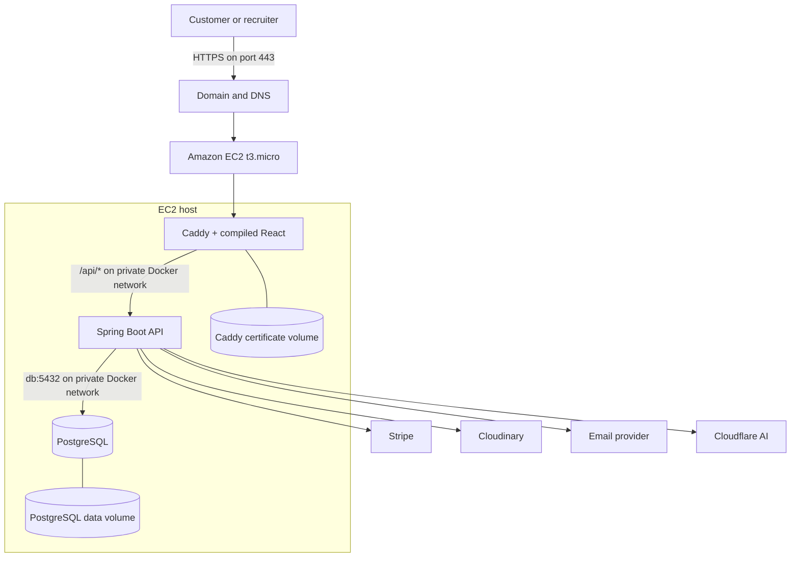

Only Caddy publishes host ports. Spring Boot and PostgreSQL are not directly reachable from the
internet.

## 2. Responsibilities

### Caddy

Caddy is the public web server and reverse proxy. It is comparable to Nginx or Apache, but it can
obtain, renew, and serve HTTPS certificates automatically.

Caddy is responsible for:

- receiving public traffic on ports 80 and 443;
- redirecting HTTP requests to HTTPS;
- obtaining and renewing the TLS certificate after DNS points to EC2;
- serving the compiled React HTML, CSS, JavaScript, fonts, and images;
- forwarding `/api/*` requests to Spring Boot;
- supporting React Router by returning `index.html` for client-side routes;
- compressing responses;
- adding security headers;
- applying browser caching rules; and
- exposing the small public `/health` readiness route.

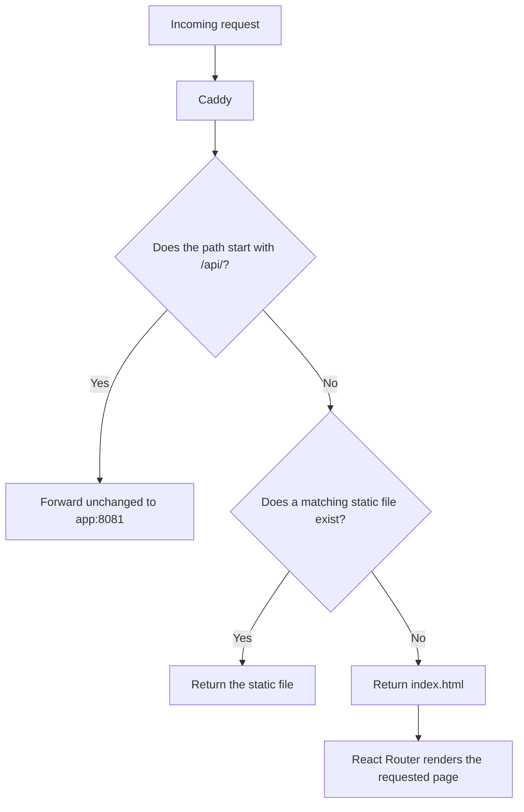

Examples:

| Request | Handler | Result |
|---|---|---|
| `GET /gallery` | Caddy and React Router | Caddy returns `index.html`; React renders Gallery |
| `GET /assets/index-ABC.js` | Caddy | Returns the compiled JavaScript asset |
| `GET /api/products` | Spring Boot | Caddy proxies the request to the API |
| `POST /api/auth/login/request-code` | Spring Boot | Caddy proxies the request to authentication |
| `GET /health` | Spring Boot through Caddy | Returns only the public readiness status |

Configuration: `deploy/Caddyfile`.

### React frontend

Vite compiles the React and TypeScript source into static browser files. Node.js is needed to build
the frontend, but a Node development server is not used in production. The completed files are
copied into the Caddy runtime image.

### Spring Boot backend

Spring Boot owns server-side behavior:

- passwordless authentication and session cookies;
- product catalogue and account history;
- cart validation, checkout, orders, and Stripe webhooks;
- contact, quick-request, embroidery, and printing submissions;
- email notifications;
- Cloudinary and AI integrations;
- validation, spam protection, and rate limits; and
- Flyway database migrations.

### PostgreSQL

PostgreSQL stores durable application data such as users, authentication sessions, products,
orders, payment-event records, and custom-design requests. Its data directory is a persistent
Docker volume, so replacing the database container does not remove the data.

## 3. Docker concepts

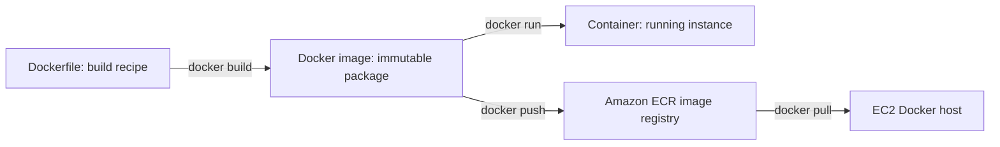

A useful analogy is:

- Dockerfile = recipe;
- Docker image = prepared, packaged meal; and
- container = a running copy being served.

### Backend multi-stage image

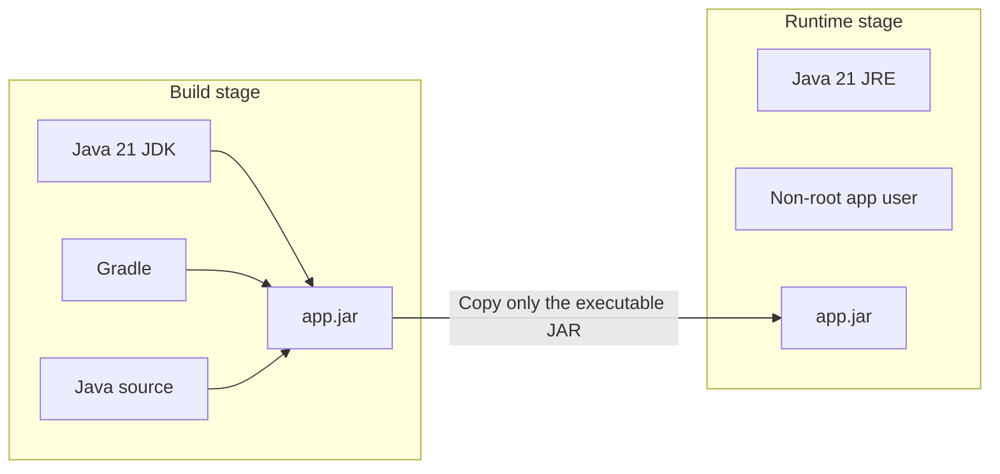

The production image excludes the source tree, compiler, and Gradle tooling. Definition:
`backend/Dockerfile`.

### Frontend multi-stage image

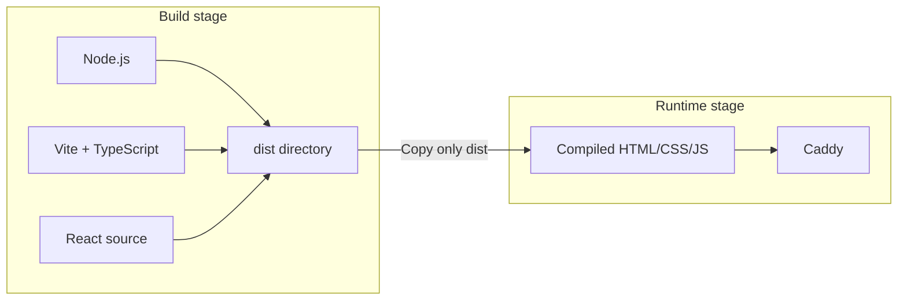

Definition: `frontend/Dockerfile`.

## 4. Docker Compose

A Dockerfile defines one image. Docker Compose defines how all services, networks, ports, health
checks, environment values, and volumes work together.

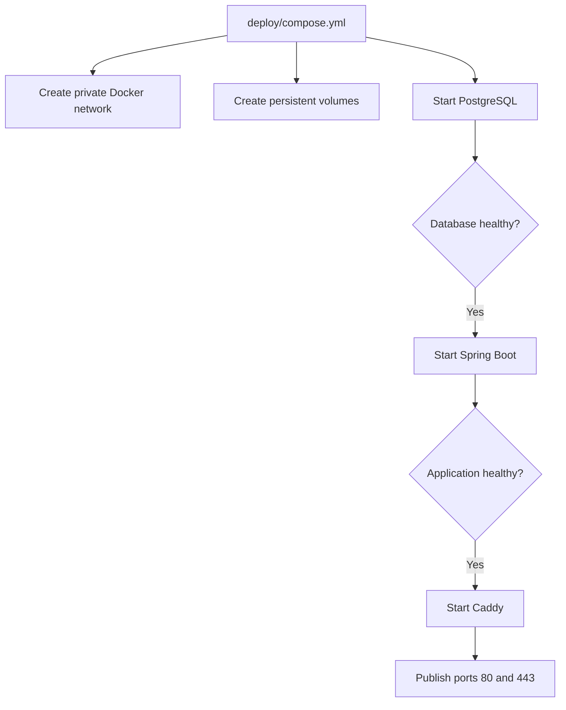

Docker supplies private service-name DNS inside the Compose network:

```text
Caddy       -> app:8081 -> Spring Boot
Spring Boot -> db:5432  -> PostgreSQL
```

The public and private ports are intentionally different:

```text
PUBLIC
EC2 :80  -> Caddy :80
EC2 :443 -> Caddy :443

PRIVATE ONLY
Spring Boot :8081
PostgreSQL  :5432
```

Definition: `deploy/compose.yml`.

## 5. Persistent storage

Containers are replaceable, while volumes preserve state.

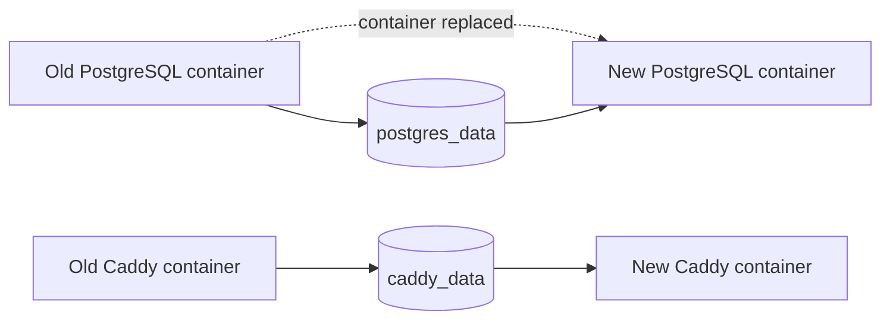

Volumes used by the stack:

| Volume | Purpose |
|---|---|
| `postgres_data` | Users, products, orders, requests, and other database records |
| `caddy_data` | HTTPS certificates and certificate state |
| `caddy_config` | Caddy runtime configuration |

Ordinary deployments and rollbacks must not use `docker compose down --volumes`.

## 6. HTTPS and the domain

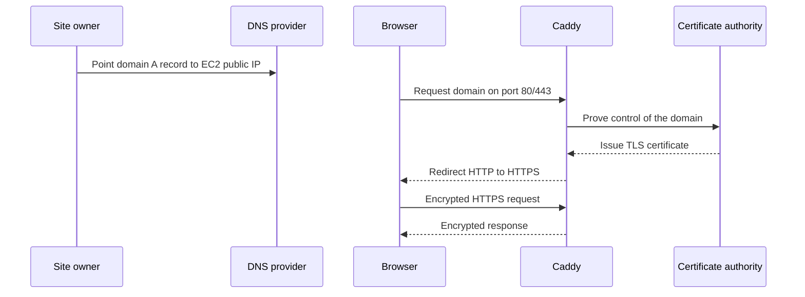

For automatic public HTTPS:

1. the domain's DNS record must point to the EC2 address;
2. the EC2 security group must allow inbound TCP 80 and 443;
3. Caddy must be able to bind those ports;
4. the Caddy data volume must be writable and persistent; and
5. `SITE_ADDRESS` must contain the real domain.

## 7. Environment configuration and secrets

The same images can run in multiple environments because configuration is supplied at runtime.

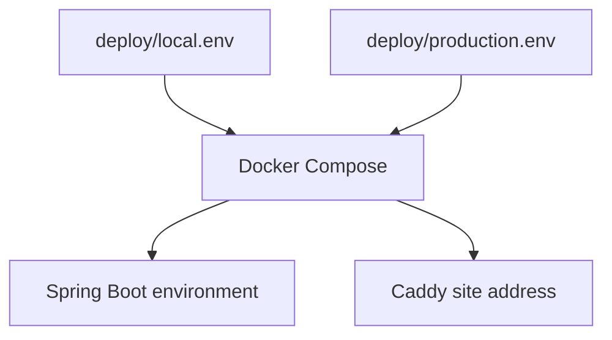

`deploy/production.env` is ignored by Git and will contain the real database password, JWT secret,
OTP pepper, Stripe secret, email credentials, and integration credentials.

Backend environment values can be private. A `VITE_*` value is compiled into browser JavaScript and
must always be treated as public. The Cloudinary cloud name is public; a Cloudinary API secret is
not.

## 8. Health and startup order

Liveness asks whether a process is functioning. Readiness asks whether it can serve real traffic.

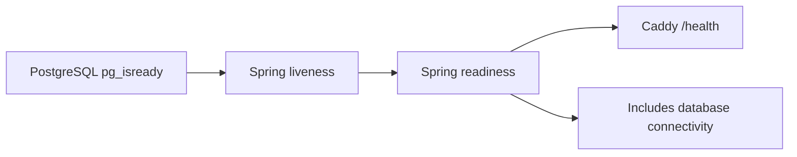

The public endpoint returns only:

```json
{"status":"UP"}
```

The production Spring profile disables Swagger and exposes only the health actuator endpoint.
Configuration: `backend/src/main/resources/application-prod.yml`.

## 9. `t3.micro` memory plan

A `t3.micro` has approximately 1 GiB of RAM. The initial limits are intentionally conservative.

```text
Approximate 1024 MiB physical RAM

┌────────────────────────────────────┐
│ Spring Boot              512 MiB   │
├────────────────────────────────────┤
│ PostgreSQL               192 MiB   │
├────────────────────────────────────┤
│ Caddy                     64 MiB   │
├────────────────────────────────────┤
│ Ubuntu and Docker       ~256 MiB   │
└────────────────────────────────────┘
```

Spring's Java heap is capped at 336 MiB, with separate space for classes, threads, and native
memory. The bootstrap script creates a 2 GiB swap file as an emergency buffer. Swap is much slower
than RAM and is not a substitute for resizing the instance if it is used continuously.

## 10. Deployment and rollback

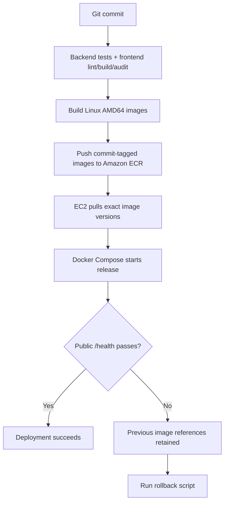

Images should use immutable Git commit tags, for example:

```text
threadandbutter-backend:a81f2c9
threadandbutter-frontend:a81f2c9
```

This identifies precisely which code is running. A mutable `latest` tag does not.

Rollback restores the previous backend and frontend image references without deleting PostgreSQL
or Caddy volumes. Database migrations should remain backward-compatible because restoring an older
application image does not automatically reverse a destructive database change.

Scripts:

- `deploy/scripts/bootstrap-ubuntu.sh`
- `deploy/scripts/deploy.sh`
- `deploy/scripts/rollback.sh`
- `deploy/scripts/local-smoke-test.sh`

## 11. Local production verification

The local smoke test exercises the production topology:

```text
Local browser/curl
       |
       v
Caddy container
       |-- React page and client-side fallback
       |-- cache and security headers
       `-- /api/products
                 |
                 v
          Spring Boot container
                 |
                 v
          PostgreSQL container
```

Verified results:

- backend tests pass;
- frontend lint passes;
- frontend production build passes;
- production npm audit reports zero vulnerabilities;
- Caddy configuration validation passes;
- an empty PostgreSQL database is constructed completely by Flyway;
- Caddy successfully proxies the product API;
- React client-side route fallback works;
- production Swagger endpoints are unavailable;
- container health checks pass; and
- the complete local production smoke test passes.

The clean-database test found two historical assumptions—the UUID extension and products table had
been prepared outside Flyway. Both are now source-controlled migrations, making a fresh deployment
reproducible.

To repeat the test:

```bash
cd deploy
cp local.env.example local.env
# Fill the public Cloudinary cloud name and keep all other values local/test-only.
./scripts/local-smoke-test.sh
```

## 12. Current deployment checklist

```text
[x] Production backend image
[x] Production frontend/Caddy image
[x] Docker Compose topology
[x] Reverse proxy configuration
[x] HTTPS-ready Caddy configuration
[x] t3.micro memory limits
[x] EC2 swap/bootstrap script
[x] Production environment template
[x] Health checks
[x] Swagger disabled in production
[x] Deployment and rollback scripts
[x] Local production smoke test
[x] Create two Amazon ECR repositories
[x] Build and push Linux AMD64 images
[x] Create the EC2 ECR/Systems Manager instance role and profile
[x] Launch and bootstrap EC2
[x] Start the production containers
[x] Configure domain DNS records for EC2
[ ] Verify public HTTPS
[ ] Configure the Stripe webhook using the public HTTPS URL
```

First AWS release prepared on September 10, 2026:

```text
Region: ca-central-1
Backend repository: threadandbutter-backend
Frontend repository: threadandbutter-frontend
Backend image tag: portfolio-20260910-1
Frontend image tag: portfolio-20260910-1
EC2 role: ThreadAndButterEC2Role
EC2 instance profile: ThreadAndButterEC2Profile
EC2 instance: threadandbutter-prod (i-007d217f308bca7e8, t3.micro, Ubuntu 24.04)
Elastic IP: 15.175.154.30
Domain: threadandbutter.ca (Spaceship records configured; CIRA registry delegation pending)
Host bootstrap: Docker 29.8.0, Docker Compose 5.5.1, and 2 GiB swap
Running services: Caddy/React, Spring Boot, and PostgreSQL (all healthy)
Runtime secrets: encrypted SecureStrings under /threadandbutter/prod/* in Parameter Store
```

The first instance uses a 16 GiB unencrypted root volume. That is acceptable only for the current
recruiter demo with no real customer data. Replace it with an encrypted volume before accepting
real customer details or orders.

The first images use a dated portfolio-release tag because the application workspace still has
uncommitted changes. Before the next release, clean generated build artifacts, commit the intended
source changes, and return to immutable Git commit tags so the deployed image maps exactly to
source control.

## 13. Near-term and future architecture

The single-instance design is appropriate for a low-traffic recruiter-facing deployment. It is not
highly available: losing the EC2 instance temporarily loses both the app and database service.

Before real commercial use, add automated database backups, monitoring and alarms, a restore test,
and stronger secret management. When traffic and recovery requirements justify it, move PostgreSQL
to RDS and the containers to ECS without changing the application's core domain model.
